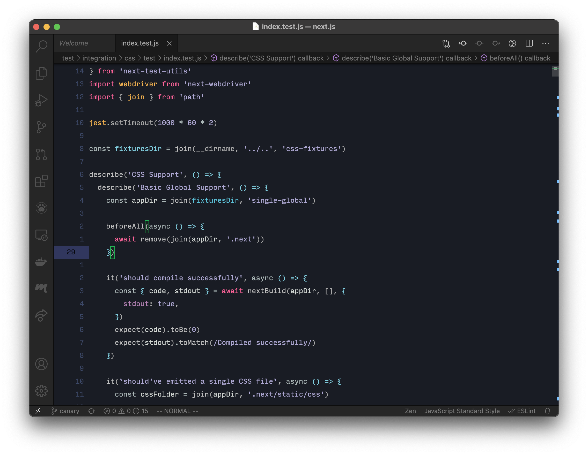
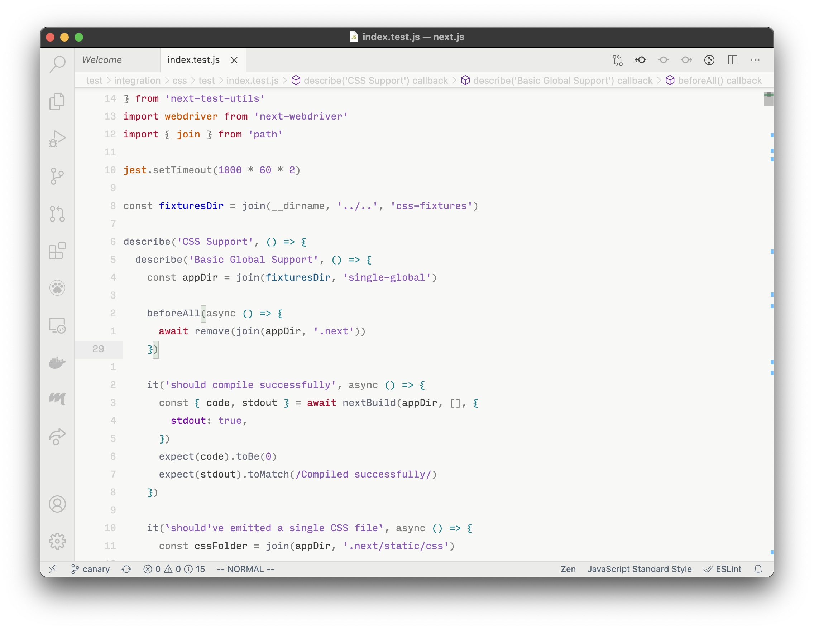
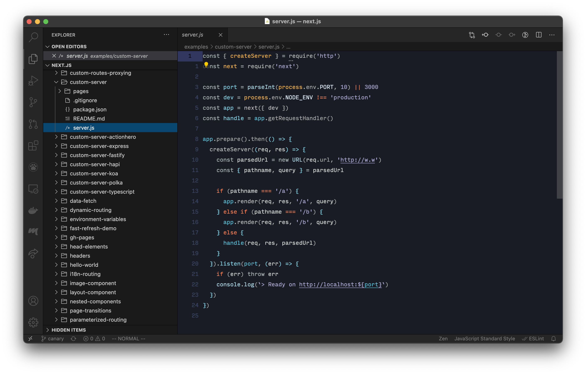
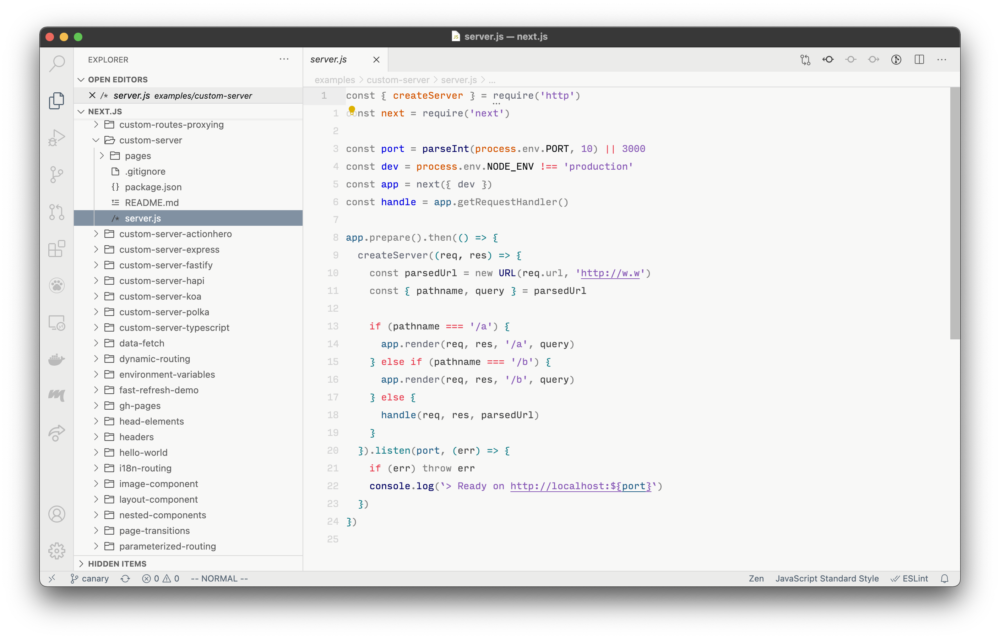
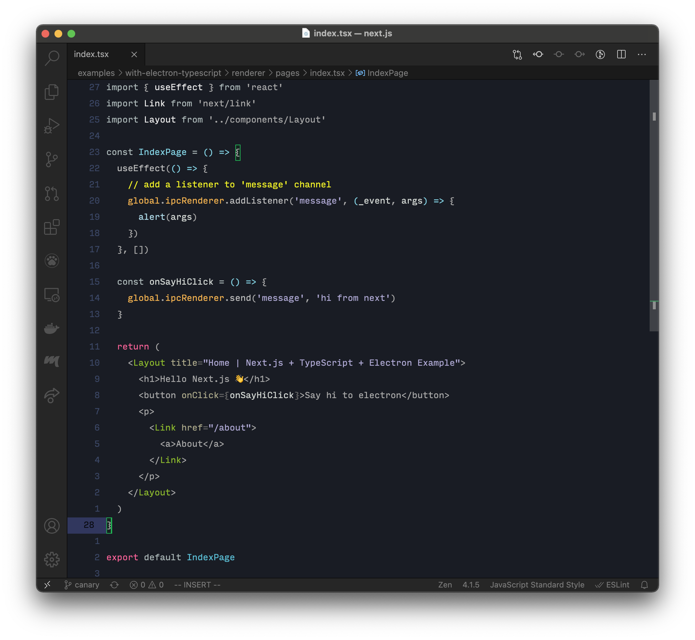
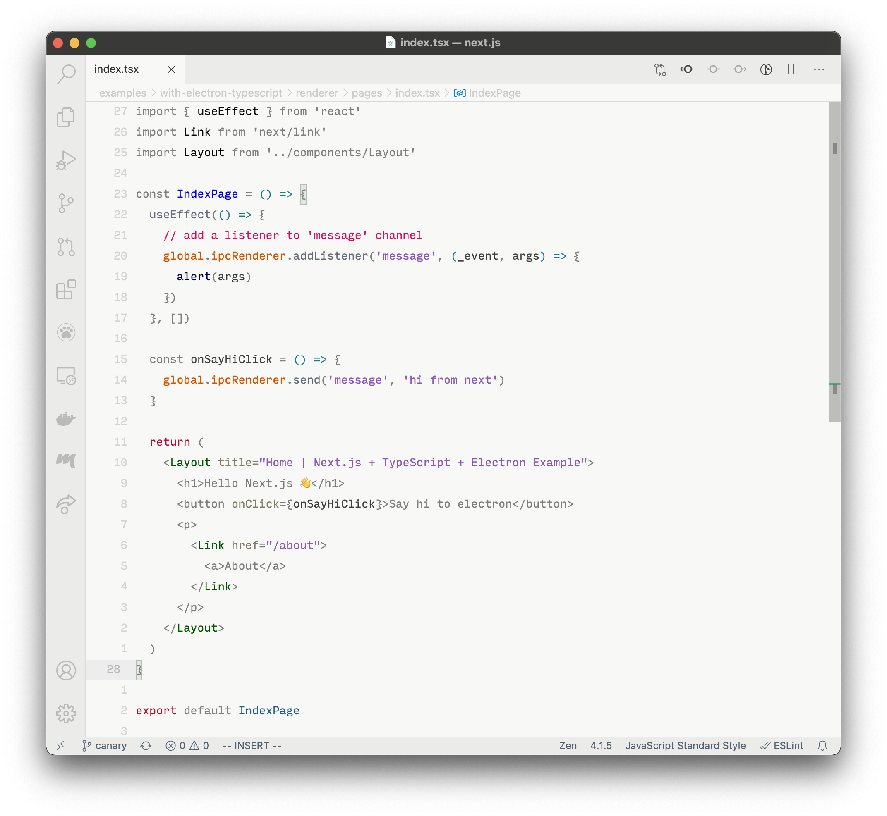

# B9F36BCF530F3D6B5C9CF39D2E260A99 (Theme)
edition: minimal semantic

This theme is created for my personal use, mostly working with web technologies such as JavaScript, React, Node.js, markdown, TypeScript, Flow, and alike, so it's probably missing a lot. Its primary aim is to help me understand the code better and not just be visually pleasing; however, I tried my best to keep it clean, accessible, and comfortable on the eyes.

It is highly opinionated! Opinions like:
- Comments should be the most visible in the file. They are either critical to understand the code or to not miss a piece; or should be removed
- The code styled in italic will be removed by the compiler (typings mostly)
- VS Code typings, Classes, and other elements of OOP (this, methods) are colored the same (Green)
- Shared state and objects need special caring and attention, colored in bright colors (Orange).
- Darker colors are heavy and dependable. Blue is calm. They constantly remind us to not share the state and to use more constants.
- Data (Strings, Numbers, Structs) is in one color (Purple)
- Flow controls and logical operations, returns, and exports show the overall structure, so bright colors.
- The rest is, mostly… text

Won't consider it minimal as the common minimalist themes or designs but actively trying to use the minimum amount of styling and colors.

## Screenshots












## Usage

While this is so in progress, my current VS Code config is as follow:

```
"editor.folding": false,
"editor.fontFamily": "input mono",
"editor.fontLigatures": false,
"editor.lineHeight": 25,
"editor.lineNumbers": "relative",
"editor.minimap.enabled": false,
"editor.overviewRulerBorder": false,
"editor.rename.enablePreview": false,
"editor.renderIndentGuides": false,
"editor.renderLineHighlight": "gutter",
"editor.renderWhitespace": "none",
"editor.scrollBeyondLastLine": true,
"editor.suggestSelection": "first",
"problems.showCurrentInStatus": true,
"chaliceIcons.showArrows": true,
"terminal.integrated.fontSize": 12,
"terminal.integrated.lineHeight": 1.3,
"workbench.panel.defaultLocation": "right",
"zenMode.hideLineNumbers": false,
"zenMode.hideTabs": false,
"window.titleBarStyle": "native",
"window.nativeTabs": true,
"workbench.editor.showIcons": false,
"workbench.iconTheme": "chalice-icon-theme",
```

Happy to hear your thoughts
